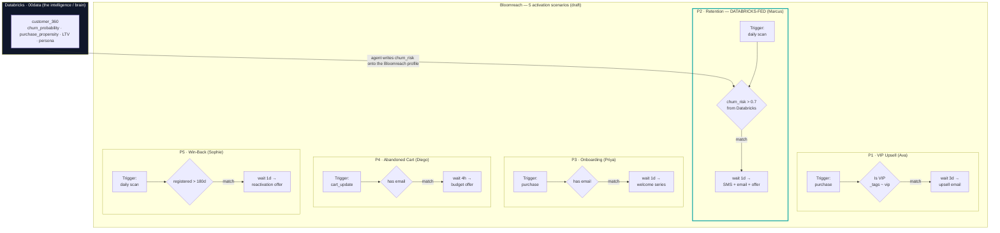

# Composable AI Hackathon 2026 — Workspace

Track **T6 — Composable commerce orchestration (Advanced)**. All four partner
platforms (Bloomreach, Google, Shopify, Databricks) must be load-bearing.
Full strategy notes: [`bloomreach_hackathon.md`](./bloomreach_hackathon.md).
Build window: 21 Sep → 28 Sep 2026 (midnight PT). Deliverables: ≤5-min demo
video, GitHub repo + README, written brief.

> **Credentials live in `.env` (gitignored).** This README holds only
> non-secret identifiers + findings. Copy the template to start:
> `cp .env.example .env`.

---

## Platform roles (T6 loop)

| Platform | Role | Contributes |
|---|---|---|
| **Databricks** | The brain | Lakehouse features + predictions (churn, propensity, LTV); Agent Bricks hosts the agent |
| **Bloomreach** | Senses + hands | Loomi Connect MCP (140+ tools), Marketing Agent, real-time behavior + activation |
| **Google/Gemini** | Reasoning + mouth | Gemini for reasoning/generation/conversation; GCP for hosting (Cloud Run / Vertex) |
| **Shopify** | Cash register | Agentic Storefronts — in-conversation checkout |

---

## 1. Databricks + Agent Bricks

- **Workspace:** `bloomreach-hackathon-workspace` — `https://dbc-REDACTED.cloud.databricks.com` (org `REDACTED_ORG_ID`, login `owner@example.com`, SSO auto-login).
- **SQL Warehouse:** `Serverless Starter Warehouse` (id `bb33046c9a986a2b`, Small, running).
- **Access:** PAT token `DATABRICKS_TOKEN` in `.env` (name `hackathon-cli`, 14-day). Metadata via `/api/2.1/unity-catalog/*`, queries via `/api/2.0/sql/statements`.

### Catalog `databricks-hackathon` → schema `00data`
(other schemas: `information_schema`, `mosaic` — empty. Other catalogs: `workspace`, `samples`, `system`.)

Small synthetic **retail commerce star schema** — 50 customers, 40 products, 1,000 orders. Date range **2024‑03 → 2026‑09**. All customers US.

| Table | Type | Rows | What's in it |
|---|---|---|---|
| `customers` | table | 50 | Master profile (name, email, phone, DOB, segment, loyalty_tier, geo, opt-in) |
| `products` | table | 40 | Catalog: 5 categories × 8 (Beauty, Home, Apparel, Electronics, Sports), `unit_cost`/`list_price` ($11–$379) |
| `transactions` | table | 1,000 | Orders: channel (web/app/store), amounts, status, payment. Revenue ≈ $491K |
| `transaction_items` | table | 2,500 | Order line items (qty, unit_price, discount, line_amount) |
| `customer_events` | table | 2,000 | Behavior: page_view, product_view, search, cart_add, checkout, login, email_click, support_case |
| `customer_features` | table | 50 | ML features (RFM, `lifetime_value` avg ≈ $8,999, recency_score, favorite_category, snapshot) |
| `customer_predictions` | table | 50 | `churn_probability` (0.01–0.99, avg 0.24), `purchase_propensity_score` (avg 0.61), `predicted_next_category` |
| `customer_360` | **view** | (50) | Denormalized join of customers + features + predictions (30 cols) — the ready-to-serve view |

**Dimensions:** segments = active / loyal / at_risk / new / dormant · loyalty = platinum / gold / silver / bronze / none · channels = web (497) / app (348) / store (155) · predicted next category spread across all 5.

> `customer_360` + `customer_predictions` are the load-bearing "brain" outputs to push onto Bloomreach profiles (e.g. `churn_risk`, `pltv_band`, `predicted_next_category`).

---

## 2. Google Cloud + Gemini (Qwiklabs)

- **Project:** `qwiklabs-gcp-00-0848b6ed47ab` (number `406265238820`), **region `us-east1` / zone `us-east1-d`**.
- **Login:** student account (`GCP_USERNAME` / `GCP_PASSWORD` in `.env`). Console: `https://console.cloud.google.com/home/dashboard?project=qwiklabs-gcp-00-0848b6ed47ab`.
- **Billing:** ~$10.94 spent (Sep 1–23, 2026).

### Already deployed
- **Compute Engine — 3 VMs, all `us-east1-d`, running:**

  | Name | Internal IP | External IP |
  |---|---|---|
  | `ai-studio-setup` | 10.142.0.2 | 34.75.240.85 |
  | `lab-setup` | 10.142.0.4 | 35.231.49.1 |
  | `lfs-setup-vm` | 10.142.0.3 | 34.75.212.51 |

  (Pre-provisioned lab VMs — `ai-studio-setup` likely hosts the Gemini/AI-Studio env.)
- **Cloud Storage:** no buckets.
- **BigQuery:** no datasets.
- **Cloud Run:** no services (Admin API not yet enabled).
- **Enabled APIs (confirmed):** Compute Engine, BigQuery. **Vertex AI / Generative Language (Gemini) not confirmed — enable before use.** "Get Agent Platform API key" is available in-console for Vertex AI Agent Builder.

---

## 3. Bloomreach

- **Engagement (CDP):** project **`gentle-gyroscope`** — `https://engagement.bloomreach.com/p/gentle-gyroscope/home` (logged in as `owner@example.com`). Nav: Overview / Campaigns / Analyses / Data & Assets / Initiatives / Use Case Center. Project shows onboarding "Integrate your project" → little/no data yet.
- **brX (Discovery / Content):** `https://brx.login.bloomreach.com/my-account` (creds in `.env`).

### Loomi Connect MCP — configured ✅
Bloomreach's agent surface (140+ tools) is set up as a project MCP in [`.mcp.json`](./.mcp.json):

```json
{ "mcpServers": { "loomi-connect": { "type": "http", "url": "https://brx.connect.loomi.ai/mcp" } } }
```

- **Transport:** HTTP · **Endpoint:** `https://brx.connect.loomi.ai/mcp` — the **partner/demo server**. Our brX account authenticates at `brx.login.bloomreach.com`, so the regional servers (`us`/`eu`/`uk`/`ca`/`ap`, which auth via `<region>.login.bloomreach.com`) reject it — the `us` server was the original config and failed with "wrong password"/"no invitation". Per [the docs](https://documentation.bloomreach.com/loomi-connect/docs/get-started-with-mcp): *"Partner organizations can build demos using the demo server at https://brx.connect.loomi.ai/mcp."*
- **Auth:** browser OAuth on first tool call — **no API key**. The consent page redirects to `brx.login.bloomreach.com`; since the hackathon browser profile is already logged in there, it completes cleanly with a click of **Allow Access**. Session persists ~30 days.
- **Activate:** approve on `claude` restart (config in `.mcp.json`), or `claude mcp add loomi-connect --transport http https://brx.connect.loomi.ai/mcp`.
- Docs: <https://documentation.bloomreach.com/loomi-connect/docs/get-started-with-mcp>

### Activation scenarios — 5 personas (created via Loomi MCP, draft)

Five automation flows in the `gentle-gyroscope` project, one per persona (source data in
[`data/personas.json`](./data/personas.json)). All are created as **draft** — activation is a
human click in the Engagement UI. **P2 is the composable, Databricks-fed one**: the agent writes
Databricks `customer_360.churn_probability` onto the Bloomreach profile as `churn_risk`, and the
scenario enrolls high-churn customers into retention.

| # | Persona | Scenario | Trigger | Scope (condition) | Action | Scenario ID |
|---|---|---|---|---|---|---|
| P1 | Ava (VIP) | VIP Upsell | `purchase` | `_tags` contains `vip` | wait 3d → upsell (predicted_next_category) | `6ab4bcbd555a482a3ea4c759` |
| **P2** | **Marcus (at-risk)** | **Retention — Databricks churn** | **daily scan** | **`churn_risk` > 0.7 (fed from Databricks)** | **wait 1d → SMS + email + offer** | `6ab4bc98555a482a3ea4c755` |
| P3 | Priya (new) | New-Customer Onboarding | `purchase` | has email | wait 1d → welcome series | `6ab4bcd116e4a748e6a3c00e` |
| P4 | Diego (deal-seeker) | Abandoned-Cart Deal | `cart_update` | has email | wait 4h → budget offer | `6ab4bcc436c77afceb1da528` |
| P5 | Sophie (dormant) | Win-Back | daily scan | registered > 180d | wait 1d → reactivation offer | `6ab4bcda16e4a748e6a3c012` |

> Note: today the Bloomreach project has 867 anonymous cookie profiles and no identified
> customers, so these scenarios won't enroll anyone until the personas are loaded + identified
> by email (see `data/README.md`). Email delivery is via the connected **Mailgun** integration;
> **SMS needs an SMS provider** (none connected yet). Discovery (personalized product search) is
> not enabled on this account — product retrieval comes from Shopify.

#### Flow diagram



---

## 4. Shopify

- **Account/org:** `owner@example.com` → Partner org **`5206397`** ("Okahu"), dedicated to the hackathon. (This machine may also have other, non-hackathon Shopify accounts/stores — don't assume, always check; see CLAUDE.md.)
- **Dev store:** **`okahu-hackathon.myshopify.com`** — Shopify **Plus** development store, **demo data enabled** (products/customers/orders, Bogus payment gateway). Admin: `https://admin.shopify.com/store/okahu-hackathon`. Free (dev store, no charge).
- Created via the **Dev Dashboard (browser)**, not the CLI — the global Shopify CLI is signed into a different, non-hackathon account and was left untouched.

### Shopify MCP — configured ✅
- **`shopify-dev`** (AI toolkit) — `npx -y @shopify/dev-mcp@latest`, no auth. Tools verified: `learn_shopify_api`, `search_docs_chunks`, `validate_graphql_codeblocks`, `validate_theme`, … (docs + GraphQL schema + validation).
- **`shopify-storefront`** — `https://okahu-hackathon.myshopify.com/api/mcp` (HTTP, no key). Exposes **only `search_shop_policies_and_faqs`**. As of **Aug 31 2026** Shopify moved catalog/cart/checkout to the **UCP endpoint** `https://okahu-hackathon.myshopify.com/api/ucp/mcp` (server `universal-commerce`; tools `search_catalog`, `get_cart`, `create_checkout`, …), where **every tool requires a `profile` (UCP agent profile URI)** — a plain MCP URL can't call them until you register an agent profile. (The dev-store password page **cannot** be removed — unrelated to this.)
  - **For catalog/orders in the build:** use the **Shopify Admin API** (AI toolkit / `store execute` GraphQL, or a custom-app Admin token) + **Loomi Connect** for personalized product search. Use UCP only for agentic checkout once an agent profile is registered.
- Also installed: **Shopify AI Toolkit** as `shopify-plugin:*` skills (Admin/Storefront GraphQL, Liquid, Functions, CLI).

### Shopify Admin API — set up + verified ✅ (the reliable catalog path)
Custom app **"Hackathon Agent"** (app id `427335450625`) installed on the store, token in `.env` (`SHOPIFY_ADMIN_API_TOKEN`, `shpat_…`). Scopes (12): products, orders, customers, draft_orders, price_rules, content, fulfillments (read+write on the core ones). Storefront/online-store password is in `.env` (`SHOPIFY_STORE_PASSWORD`).

Verified live against `https://okahu-hackathon.myshopify.com/admin/api/2025-01/…`:
- `shop.json` → 200 (Okahu Hackathon, Shopify Plus, USD)
- `products/count` → **17**, `customers/count` → **3**, `orders/count` → 0 (demo data seeds products + customers, no orders)

Call it with header `X-Shopify-Access-Token: $SHOPIFY_ADMIN_API_TOKEN`, or via the AI toolkit (`shopify-plugin:shopify-admin`) and `npx @shopify/cli@latest store execute`.

---

## Browser (gstack) — isolated hackathon profile

All three consoles are driven in a dedicated, isolated Chrome-for-Testing profile
so logins persist across sessions and never mix with your default browser.

```bash
source .hackathon-browser.env      # sets CHROMIUM_PROFILE=~/.gstack/hackathon-profile
~/.claude/skills/gstack/browse/dist/browse connect     # opens the headed window
```

Only the **headed** browser has a persistent profile; plain `browse goto` (headless)
is ephemeral. Databricks, GCP (student), and Bloomreach sessions are all saved here.

---

## Files & security

| File | Tracked? | Purpose |
|---|---|---|
| `.env` | **no** (gitignored) | All real credentials + tokens |
| `.env.example` | yes | Key template for teammates |
| `.mcp.json` | yes | 5 MCP servers (loomi-connect, shopify-dev, shopify-storefront, databricks-genie, databricks-uc-functions); secrets via `${VAR}` |
| `.claude/settings.local.json` | **no** (gitignored) | MCP secrets (`DATABRICKS_TOKEN`) — Claude Code reads env from here, not `.env` |
| `.hackathon-browser.env` | **no** (gitignored) | Points gstack at the isolated profile |
| `CLAUDE.md` | yes | Agent guide + **do-not-touch** guardrails for the other accounts on this machine |
| `bloomreach_hackathon.md` | yes | T6 strategy + demo concepts |
| `README.md` | yes | This file |

`.gitignore` covers macOS junk (`.DS_Store`, `._*`, …) and secrets (`.env*`,
`*.pem`, `*.key`, `service-account*.json`, `.databrickscfg`, `.gstack/`, …).
**Never commit `.env`.** The Databricks PAT expires in 14 days; rotate via
User Settings → Developer → Access tokens.
